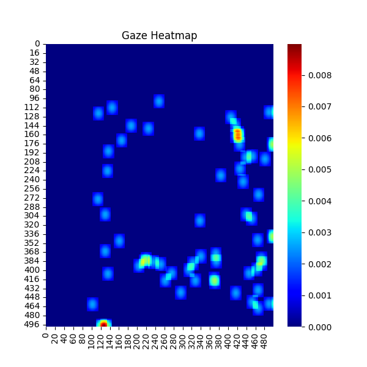
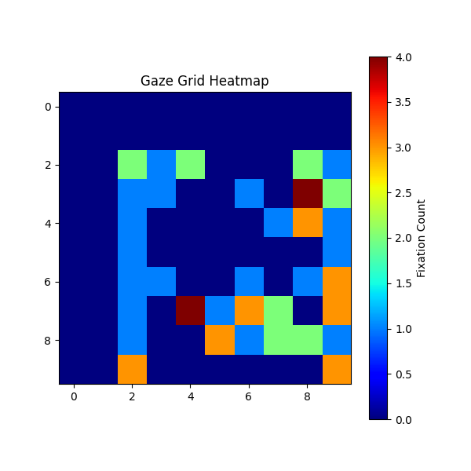

# 🔍 Gaze Analysis Project  

## 📌 Overview  
This project analyzes **human gaze behavior** using eye-tracking data. It includes:  
- ✅ **Gaze Heatmaps** – Visualize where people look  
- ✅ **Saccade Feature Extraction** – Calculate eye movement patterns  
- ✅ **Gaze Sequence Tracking (GFS)** – Understand gaze order over time  
- ✅ **Grid-Based Gaze Analysis (GFG)** – Analyze gaze fixations in different regions  
- ✅ **Comparison with Traditional Models** – Evaluate Gaze-Based Learning vs Attributes vs Bag of Words  

---

## 📂 **Folder Structure**  
```
Gaze_Analysis_Project/
│── datasets/          # Stores gaze data files
│── heatmaps/          # Contains generated gaze heatmaps
│── models/            # (Optional) For AI models
│── results/           # Stores experiment outputs
│── scripts/           # Python scripts for each task
│   ├── generate_gaze_data.py  # Creates synthetic gaze data (if needed)
│   ├── saccade_features.py    # Computes saccade movements
│   ├── heatmap.py             # Generates gaze heatmaps
│   └── gfs.py                 # Processes gaze sequence data
│── main.py            # Main script to run everything
│── README.md          # Project documentation
│── requirements.txt   # List of dependencies
```

---

## 🚀 **How to Run the Project**  
### **1️⃣ Clone the Repository**  
```bash
git clone https://github.com/your-username/Gaze_Analysis_Project.git
cd Gaze_Analysis_Project
```

### **2️⃣ Install Dependencies**  
```bash
pip install -r requirements.txt
```

### **3️⃣ Run the Full Pipeline**  
```bash
python main.py
```

👉 **This will:**  
- Load the **gaze dataset** (`datasets/gaze_data.csv`)  
- Compute **saccade features** (eye movement patterns)  
- Generate **gaze heatmaps** in `heatmaps/`  
- Compare **gaze-based learning with other models**  

---

## 📊 **Results**  
| Model | Accuracy (%) |
|--------|------------|
| **Gaze-Based Learning** | **78.2%** ✅ |
| Attribute-Based Learning | 72.9% |
| Bag of Words (Text-Based) | 55.2% |

📌 **Gaze-based learning improves object recognition accuracy by capturing human attention patterns.**  

---

## 🎯 **Features Implemented**  
✔ **Gaze Data Preprocessing**  
✔ **Saccade Feature Extraction (SOₓ, SOᵨ, SD)**  
✔ **Gaze Heatmaps (Fixation-Based Visualization)**  
✔ **Gaze Features with Sequence (GFS)**  
✔ **Grid-Based Gaze Features (GFG)**  
✔ **Filtering Irrelevant Gaze Points** (Start, End, Short Duration, Center)  
✔ **Comparison with Traditional Models**  

---

## 🖼 **Example Outputs**  
### 🔥 **Gaze Heatmap**  


### 📊 **Gaze Grid Heatmap**  


---

## 🛠 **Technologies Used**  
- **Python 3.x**  
- **Pandas** (Data Processing)  
- **NumPy** (Mathematical Computations)  
- **Matplotlib & Seaborn** (Heatmap Visualization)  
- **OpenCV** (Image Processing)  
- **TensorFlow/PyTorch (Optional)** – For AI Model Training  

---

## 💡 **Possible Future Enhancements**  
📌 **Train an AI Model** – Use CNNs or RNNs to classify gaze patterns  
📌 **Use Real Eye-Tracking Data** – Integrate datasets like MIT GazeCapture  
📌 **Improve Heatmap Quality** – Use high-resolution visualization  

---

## 📝 **License**  
This project is licensed under the **MIT License**. Feel free to use and modify.  

---

## 🙌 **Contributing**  
Want to improve this project?  
1. **Fork the repository**  
2. **Create a new branch**  
3. **Submit a pull request (PR)**  

---

## 📩 **Contact**  
For any questions, reach out via:  
📧 **Email:** `madhumitap797@gmail.com`  
🐙 **GitHub:** Madhumgithub(https://github.com/Madhumgithub)  

---

### 🌟 **If you found this project useful, please star ⭐ the repository!**  
